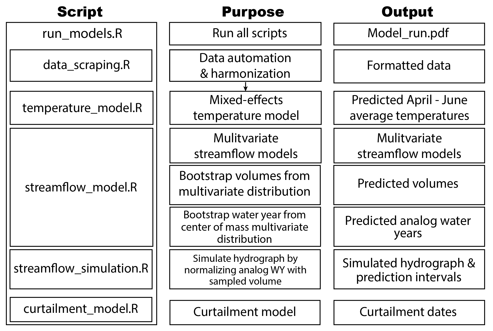

\newpage

```{r include=FALSE}
setwd("~/github/WRWC/")
library(gridExtra)
```

```{r setup, include=FALSE}
knitr::opts_chunk$set(echo = TRUE)
```

# 1. Introduction
The Wood River Collaborative is a grassroots effort to tackle water usage challenges among irrigators, municipalities, and protect minimum flows for fish and wildlife habitat. Its many, basin-wide participants include private citizens, representatives of water agencies, non-profit organizations, private interests and the public sector. The outcome of the collaboration is to bring all stakeholders together and develop strategies and tools for best use of water for consumptive use, while conserving water for groundwater and in-stream flows.

The following suite of modeling tools were developed in response to stakeholder interests in improving management of surface and groundwater resources for agriculture and conservation purposes. These tools include automated data retrieval and organization for use in predictive models of irrigation season streamflow volume and timing in the Big Wood River Basin at the Hailey and Stanton Crossing gages, Camas Creek, and Silver Creek at Sportsman's Access (Figure 1). Annual river diversions are also predicted to estimate curtailment dates for three water right priority dates. 

```{r, Map, echo=FALSE, fig.cap="Figure 1: Map of the Big Wood River, Camas Creek and Silver Creek Watersheds and locations of automated data", fig.aling="left", out.width = '90%'}
#knitr::include_graphics("figures/WRWC_model_domain.png")
```


# 2. Methodology & Model Fits

## Overview 
Individual multivariate linear regression models were developed for each of these locations using USGS streamflow data, Snotel SWE and temperature data, AgriMet temperature data, and diversion data from Water District 37 (Table 1). The Baysian Information Criterion (define & cite) was used to select model parameters for each of the gage locations for both total irrigation season streamflow volume and timing, characterized by the center of mass. Center of mass definition here.... 

```{r, Data_sources, echo=FALSE, fig.cap="Table 1: Data sources used in model development", fig.aling="left", out.width = '90%'}
#knitr::include_graphics("figures/Data_sources.png")
```

Once the linear regression models were developed for total irrigation season volume and timing at each location, multivariate distributions were used to stochastically model hydrographs for each location. The residuals (standard error) from each of the regression models and correlations between gauge stations are used to create the multivariate distributions. This ensures that given a set of predictor variables (e.g. SWE, temp) the predicted volumes will be statistically consistent across gage locations (e.g. the models wont predict that Camas Creek will have really low runoff year while the Big Wood has a really high runoff year because they are statistically correlated). Repeated, random selection from these multivariate distributions produces a sample of predicted volumes and timing of streamflow. The samples of total volume and streamflow timing are then used to create simulations of the irrigation season hydrograph. Variability in final model outputs is quantified by percentiles of the resulting predictions. 

```{r, Model_Workflow, echo=FALSE, fig.cap="", fig.aling="left", out.width = '90%'}

```

## Reproducibility

All model scripts have been developed using gitHub as the code repository. This enables tracking of all model changes, sharing of model code with WRWC members and a mechanism for users to post 'issues' to the code repository (`https://github.com/kendrakaiser/WRWC`). When the model is updated a versioning standard will be used to update 


## 2.1 Data Downloading and Organization
Automation of data downloads and processing ensures that all data is formatted properly. Creating a local folder for each model run where all formatted data is saved will be valuable for reproducibility purposes.

### USGS
```{r, Historic_streamflow, echo=FALSE, fig.cap="", fig.aling="left", out.width = '100%'}
#knitr::include_graphics("figures/historic_streamflow.png")
```
### Snotel
### Agrimet
explain how to download specific RNRCS package
`devtools::install_github(repo = "rhlee12/RNRCS", subdir = "/RNRCS/", force =TRUE)`

### Snow Cover Extent
summary details of Google Earth Explorer outcomes and reference to the other summary report

### Diversion & Curtailment Data
This data was compiled by WRWC by manually entering data from the irrigation district black books
and should be updated annually for future model revisions. Currently the following diversions are included:
BWB:
SC:

Smaller diversions were not included in this model version as they were considered to be minor given time constraints.

```{r, Historic_diversions, echo=FALSE, fig.cap="", fig.aling="left", out.width = '50%', fig.pos='H'}
knitr::include_graphics("figures/Div.abv.Hailey.png") # change to total diversions
```

## 2.2 Temperature Model (tbd)

## 2.3 Streamflow Models
Initial model development was explored using the `streamflow_model_exlploration.R` script. The full suite of predictor variables were subset for each gage and the final set of predictor variables were determined using the `regsubsets` package, which enables visualization of adjusted R2 and BIC of each parameter set (e.g. Figure X). Final streamflow models are defined and synthesized in `streamflow_models.R`, this script also creates predictions for each model for the user defined year. 

```{r, Regsubsets BIC example, echo=FALSE, fig.cap="", fig.aling="left", out.width = '50%', fig.pos='H'}
#knitr::include_graphics("figures/regsubsets_bwh_BIC.png")
```


First, data is imported, and data structures are set up to save model output. The `modOut` function returns relevant metrics and statistics from the modeled results for the year being predicted. 


```{python, echo=TRUE, eval=FALSE, python.reticulate=FALSE}
modOut<- function(mod, pred.dat, wq, vol, meanSWE, lastQ){}
```

After this function is defined, the same set of steps occurs for each linear model. 1) The model parameters are subset from the full dataset, 2) the linear model is created & summary metrics are saved, 3) Prediction data is subset, 4) Predictions are made and outputs (estimated volume and standard error) are saved.


```{python, echo=TRUE, eval=FALSE, python.reticulate=FALSE}
# 1. Subset Big Wood Winter flows, snotel from  Galena & Galena Summit, Hyndman
hist <- var[var$year < pred.yr,] %>% select(bwb.vol.nat, g.swe, gs.swe, hc.swe) 
# 2. Create Big Wood at Hailey linear model
bwb_mod<-lm(log(bwb.vol.nat)~ g.swe+ log(gs.swe)+ hc.swe, data=hist) 
mod_sum[1,1]<-summary(bwb_mod)$adj.r.squared
# 3. Subset April 1 Prediction Data
pred.dat<-var[var$year == pred.yr,] %>% select(g.swe, gs.swe, hc.swe) 
# 4. Big Wood at Hailey Model output
mod_out<- modOut(bwb_mod, pred.dat, hist$bwb.wq, hist$bwb.vol.nat, mean(hist$g.swe,  hist$gs.swe,  hist$hc.swe, trim=0, na.rm=T), var$bwb.vol.nat[var$year == pred.yr-1])
output.vol[1,] <- mod_out[[1]]
pred.params.vol[1,] <- mod_out[[2]] # standard error, "sigma"
```

After the streamflow volume model section of code, the same procedure is done for creating multivariate linear regressions for predicting center of mass. Here, model fits for irrigation season volume and center of mass ar shown together for each gage. # ADD PI to the model fit figures

```{python, echo=TRUE, eval=FALSE, python.reticulate=FALSE}
# Big Wood at Hailey Natural Flow Volume model
bwb_mod<-lm(log(bwb.vol.nat)~ g.swe+ log(gs.swe)+ hc.swe, data=hist) 
# BW Hailey Natural Flow Center of Mass model
bwb_mod.cm <-lm(bwb.cm.nat ~ log(bwb.wq) + g.swe+ hc.swe+ t.g +t.gs+t.lw+ log(cg.swe)+log(gs.swe), data=hist)
```

```{r, Big Wood Hailey Model Fits, echo=FALSE, fig.cap="", fig.show="hold", out.width = '50%', fig.pos='H'}
knitr::include_graphics(c("figures/BWB_modelFit.png", "figures/BWB_CMmodelFit.png"))
```

### Big Wood at Stanton Crossing

```{python, echo=TRUE, eval=FALSE, python.reticulate=FALSE}
# Big Wood at Stanton Natural Flow Volume model
bws_mod<-lm(log(bws.vol.nat)~bws.wq+ log(g.swe) + log(gs.swe)+ log(hc.swe), data=hist) 
# Big Wood at Stanton Natural Flow Center of Mass model
bws_mod.cm <-lm(bws.cm.nat ~ lwd.swe +log(cg.swe)+log(hc.swe) + t.cg + t.g + t.hc + t.lw, data=hist)
```

```{r, Big Wood Stanton Model Fit, echo=FALSE, fig.cap="", fig.show="hold", fig.aling="left", out.width = '45%', fig.pos='H'}
knitr::include_graphics(c("figures/BWS_modelFit.png", "figures/BWS_CMmodelFit.png"))
```

### Silver Creek

The Silver Creek Model is unique in that it uses a mixture of SWE data from both the Big Wood and Little Wood Basins. While it is not traditional to use SWE from outside of a delineated HUC basin, none of the SNOTEL sites are adequate representations of the snow that is contributing to the Silver Creek Watershed. Given this data limitation and the groundwater interactions between Big Wood and Silver Creek, the model includes SWE data from Galena, Chocolate Gulch, and Swede Peak. This is one utility of using a statistical model, namely if SWE from these locations are correlated to flows in Silver Creek historically, they can do a sufficient job of predicting flows in the basin. Further discussion on viable next steps for the Silver Creek Model are discussed in the Recommendations section. 

```{python, echo=TRUE, eval=FALSE, python.reticulate=FALSE}
# Silver Creek Flow Volume model
sc_mod<-lm(log(sc.vol)~sc.wq+sp.swe + g.swe + log(cg.swe), data=hist)  
# Silver Creek Natural Flow Center of Mass model

# UPDATE THIS ONCE DIVERSIONS ARE INCORPERATED
```

```{r, Silver Creek Model Fit, echo=FALSE, fig.cap="", fig.show="hold", fig.aling="left", out.width = '45%', fig.pos='H'}
#knitr::include_graphics("figures/SC_modelFit.png")
```

### Camas Creek

```{python, echo=TRUE, eval=FALSE, python.reticulate=FALSE}
# Camas Creek Flow Volume model
cc_mod<-lm(log(cc.vol)~log(cc.wq)+sr.swe+ccd.swe, data=hist) 
# Camas Creek Center of Mass model
cc_mod.cm<-lm(cc.cm~ccd.swe + sr.swe+ t.f, data=hist) 
```

```{r, Camas Creek Model Fit, echo=FALSE, fig.cap="", fig.show="hold", fig.aling="left", out.width = '45%', fig.pos='H'}
knitr::include_graphics(c("figures/CC_modelFit.png", "figures/CC_CMmodelFit.png"))
```

### Big Wood Diversions
```{python, echo=TRUE, eval=FALSE, python.reticulate=FALSE}
```

```{python, echo=TRUE, eval=FALSE, python.reticulate=FALSE}
```

### Silver Creek Diversions

explanation of use of covariance matrix for sampling from multivariate distribution
```{r, Covariance_matrix, echo=FALSE, fig.cap="", fig.aling="left", out.width = '100%', fig.pos='H'}
knitr::include_graphics("figures/correlation_matrix.png")
```

## 2.4 Streamflow Simulation

simulation and prediction intervals

## 2.5 Curtailment Model and Simulation

# 3. Overview of modeling results

# 4. Recommendations


