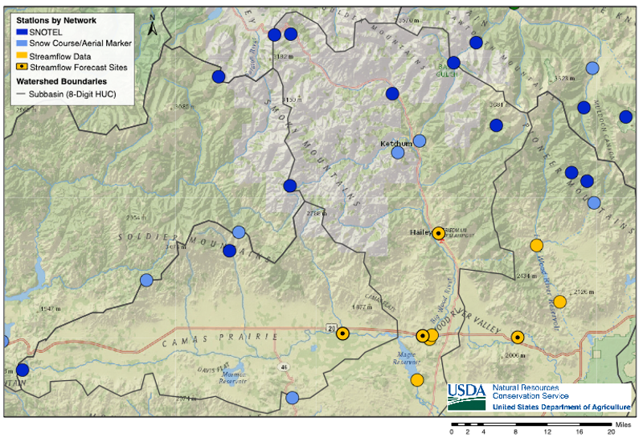
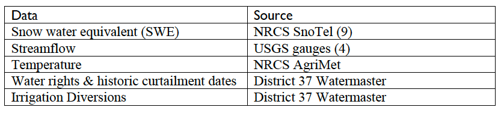
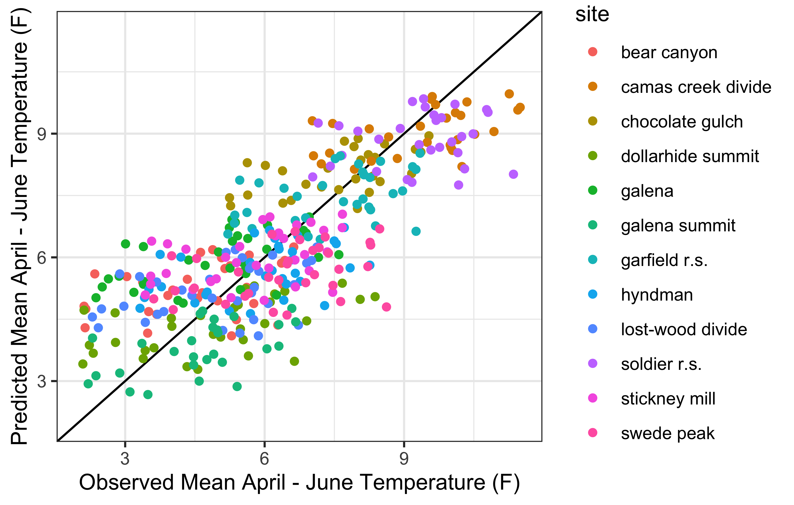
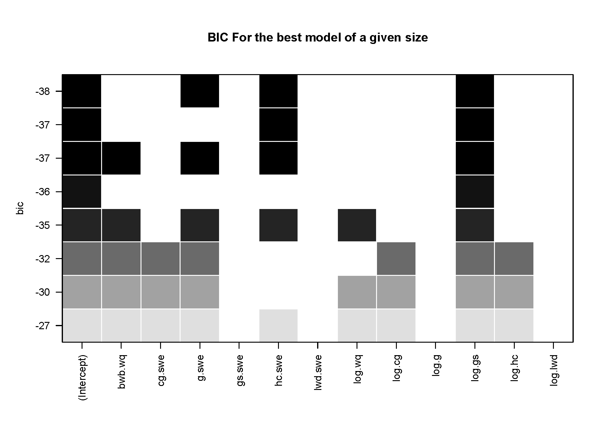

\newpage
```{r include=FALSE}
library(knitr)
library(tidyverse)
library(rlist)
library(kableExtra)
usgs_sites = read.csv('~/Desktop/WRWC/data/usgs_sites.csv')
snotel_sites = read.csv('~/Desktop/WRWC/data/snotel_sites.csv')
vol.params <<- list.load('~/Desktop/WRWC/data/mar_vol_vars.rdata')
```

# 1. Introduction
The Wood River Collaborative is a grassroots effort to tackle water usage challenges among irrigators, municipalities, and protect minimum flows for fish and wildlife habitat. Its many, basin-wide participants include private citizens, representatives of water agencies, non-profit organizations, private interests and the public sector. The outcome of the collaboration is to bring all stakeholders together and develop strategies and tools for best use of water for consumptive use, while conserving water for groundwater and in-stream flows.

The following suite of modeling tools were developed in response to stakeholder interests in improving management of surface and groundwater resources for agriculture and conservation purposes. These tools include automated data retrieval and organization for use in predictive models of irrigation season streamflow volume and timing in the Big Wood River Basin at the Hailey and Stanton Crossing gages, Camas Creek, and Silver Creek at Sportsman's Access (Figure 1). Annual river diversions are also predicted to estimate curtailment dates for three water right priority dates. 

```{r, Map, echo=FALSE, fig.cap="Map of the Big Wood River, Camas Creek and Silver Creek Watersheds and locations of automated data", fig.aling="left", out.width = '90%'}

```

## Getting Started
Download code zip file by clicking on the green code button and save in a convineient place on your computer. You will need to enter this file path into the scripts to run the code locally.

Install RStudio on your computer https://rstudio.com/products/rstudio/download/

### Setup file directories
 There are two sets of file paths for the project. The first are the paths to where you saved the gitHub code files, and the second set is a local folder where final datasets and .csv files will be saved. The github file directories contain the code and a folder for output figures, these figures need to be in the same directory as the `.Rmd` file in order for the model run report to compile correctly. The local folder where output is saved will be overwritten every time the model is run, so if saving model outputs is of interest, create another subfolder with a naming convention like '2021-02-01_ModelRun_lastname' where you copy and paste model outputs.
 
You will need to create the following set of subfolders in the local folder for data to be saved to: 
* April_output
* data
* February_output
* March_output

``` 
#
```
## Run the Models
 
 The only script you need to open to run the models is `run_models.R`. In this script you will modify the file paths and run date as described below. The `packages` automatically installs and loads the libraries needed to run all the scripts. Once you have installed the packages once, you may comment out the installation lines with a `#`.
 
### File paths
There are two sets of file paths for the project. The first are the paths to where you saved the gitHub code files, in the example: `'~/github/WRWC/`, and the second set is the local folder where final datasets and .csv files will be saved. 

```
# GitHub File Paths
git_dir <<- '~/github/WRWC'

# Local File Paths
cd <<- '~/Desktop/WRWC'
```

### Run Date and Prediction Year

The  prediction year is the year of interest, and the 'run_date' is the date that you are running the models. In this case, there is a different set of models that are run for February / March / April 1. The optional name inputs are provided, any other naming convention will not work (e.g. March1 or mar1 will not work, only 'march1'. The models cannot be run prior to the run date (e.g. 'feb1' 2021) because the predictor variables will not be available yet.

```
# set prediction year
pred.yr <<- 2019
# set run date for set of models to use 'feb1', 'march1', 'april1'
run_date <<- 'april1'


```
### Information for Model Run Report
 
This information is printed at the top of the model run report and is valuable for tracking model outputs over time.
 
 ```
 # info for model run report
author = "Kendra Kaiser"
todays_date = "01/14/2021"
```

### Model Support
If you run the model and an error occurs, the process for getting help is to raise an 'issue', you can do this by following these steps https://docs.github.com/en/free-pro-team@latest/github/managing-your-work-on-github/creating-an-issue. This will automatically send me an email so that I can help resolve the issue. 


# 2. Methodology & Model Fits

## Overview 
Individual multivariate linear regression models were developed for each of these locations using USGS streamflow data, Snotel SWE and temperature data, AgriMet temperature data, and diversion data from Water District 37 (Table 1). The Baysian Information Criterion (BIC, 2008) was used to select model parameters for each of the gage locations for total irrigation season streamflow volume and timing, characterized by the center of mass. Center of mass is the mean of the probability distribution of April - September streamflow, or the date of the "mean" streamflow between April and September. Linear regressions were also created to estimate total diversions in the Big Wood above Stanton Crossing and in Silver Creek above Sportsmans' Access. These predicted diversions are subtracted from the USGS gage data to predict "natural" flow at each gage. This "natural" flow is needed to predict curtailment dates. 

```{r, Data_sources, echo=FALSE, fig.aling="left", out.width = '90%'}

```

Once the linear regression models were developed for total irrigation season volume, diversions, and timing at each location, multivariate distributions were used to stochastically model hydrographs for each location. The residuals (standard error) from each of the regression models and correlations between gauge stations are used to create the multivariate distributions. This ensures that given a set of predictor variables (e.g. SWE, temp) the predicted volumes will be statistically consistent across gage locations (e.g. the models wont predict that Camas Creek will have really low runoff year while the Big Wood has a really high runoff year because they are statistically correlated). Repeated, random selection from these multivariate distributions produces a `sample` of predicted volumes and timing of streamflow. The samples of total volume and streamflow timing are then used to create simulations of the irrigation season hydrograph. Variability in final model outputs is quantified by percentiles of the resulting predictions. 

The methods for predicting curtailments dates currently follow those for streamflow timing, where once the linear regressions are made the covariance between curtailment dates are used to create a multivariate distribution from which potential dates are sampled from.

The suite of linear regression models are unique to each run date, February 1st, March 1st and April 1st. In February and March, the linear regressions for diversions above the Big Wood at Stanton gage did not preform well, so the diversions are sampled from a normal distribution created from the historic data. The curtailment models are currently only in the April model run, this is largely due to the high uncertainty in the results of these models. This uncertainty largely comes from the compounding uncertainty from predictions of total seasonal streamflow volume, temperatures and diversions.

```{r, Model_Workflow, echo=FALSE, fig.aling="left", out.width = '80%'}
knitr::include_graphics("figures/ModelWorkflow_details.png")
```

## Reproducibility

All model scripts have been developed using gitHub as the code repository. This enables tracking of all model changes, sharing of model code with WRWC members and a mechanism for users to post 'issues' to the code repository (`https://github.com/kendrakaiser/WRWC`). When the model is updated a versioning standard will be used to update 


## 2.1 Data Downloading and Organization
Automation of data downloads and processing ensures that all data is formatted properly. Creating a local folder for each model run where all formatted data is saved will be valuable for reproducibility purposes.

### USGS

```{r, Historic_streamflow, echo=FALSE, fig.show='hold', out.width="50%"}
knitr::include_graphics(c("figures/historic_streamflow.png", "figures/historic_streamflow_sc.png"))
```
```{r, usgs-sites, echo=FALSE, fig.show='hold', out.width="80%"}
kable(usgs_sites[c(1,2,3,5),] %>% dplyr::select(station_nm, huc_cd, begin_date, end_date, abv), caption = "USGS Sites")
```

### Snotel

Snotel data from all locations in the Big Wood, Camas Creek and Little Wood drainages are included in the automated data downloading. This data includes snow water equivalent (SWE), cumulative precipitation, max, min and average daily temperatures.

```{r data inputs, , out.width="65%"}
kable(snotel_sites %>% dplyr::select(start, end, site_name, huc8, abv), caption = "Snotel Sites")
```

### Agrimet
A specific function has been developed to download the AgriMet data without timing-out the servers. This has been added to the `code` folder (`grabAgriMetData.R`) to make installation easier. Temperature data from Fairfield and Picabo are included. 

### Snow Cover Extent

Remotely sensed snow cover extent was explored as a means to represent snow derived water availability in conjunction with Snotel data for the predictive streamflow model. Google Earth Engine (GEE) was used to extract snow covered extent (SCE) from Landsat images (16 day return interval, 30m resolution). For the purposes of this exploratory analysis, data from Landsat5 TM from 1983-2013 was used. A GEE script gathers all images over the Wood River Basin (WRB), filters out pixels that are cloud covered, or otherwise problematic, and applies the Normalized Difference Snow Index (NDSI) to the remaining pixels. Although this analysis lead to 408 total images that have greater than 50% coverage (clear pixels), very few of these images cover winter months. Additional modeling will be needed to use any remotely sensed snow cover data.

### Diversion & Curtailment Data
This data was compiled by WRWC by manually entering data from the irrigation district black books
and should be updated annually for future model revisions. Currently the following diversions are included:

BWB: Tom P2, Lewis 1, Ketchum 2, McCoy 3, Peters 17C1, Hiawatha 22, Osborn24, and Cove 33 (above Hailey), WRVID 45, Bannon 49, Glendale 50, Baseline 55, Brown 57F1, Brown 57F2, Black 61, Graf 62, Uhrig 63, Flood 64
SC: Teeter Canyon P5,	Stalker Creek P7,	Gillihan Bashaw,	Gillihan Picabo Live,	Gillihan Woods,	Stanfield 13,	Albrethson 17,	Kilpatrick 18,	Iden 19 Fish and Game,	Iden 19 Picabo Livestock

Smaller diversions were not included in this model version as they were considered to be minor given time constraints.

```{r, Historic_diversions, echo=FALSE, fig.show='hold', out.width="50%"}
knitr::include_graphics(c(file.path("figures/April", "Div.bw.png"), file.path("figures/April", "Div.sc.png")))
```

## 2.2 Temperature Model

A linear regression model was developed to predict mean April - June temperatures at each SNOTEL site. April - June temperatures are predictors in the center of mass regressions, so a bootstrapped sample of predicted temperatures are used.

```{python, echo=TRUE, eval=FALSE, python.reticulate=FALSE}
# linear regression using elevation and year
lr.elev<- lm(spring.tempF~  elev+year, data=input)
# data for prediction
new.data<-data.frame(array(NA,c(length(site.key),4)))
colnames(new.data)<-c("year","site", "elev", "spr.tempF")
new.data$year<-rep(last.yr+1,length(site.key))
new.data$site<-(site.key)
new.data$elev<-elev

#predict the mean april-june temperature at each site
new.data$spr.tempF[1:12]<-predict(lr.elev, new.data[1:12,])
# use the mean of fairfield and picabo - has no trend and decreasess strength of lm
new.data$spr.tempF[13]<- mean(tdata$spring.tempF[tdata$site == "fairfield"])
new.data$spr.tempF[14]<- mean(tdata$spring.tempF[tdata$site == "picabo"])

# Draw stream temperatures using multivariate normal distribution
nboot<-5000
aj.pred.temps<- mvrnorm(nboot, new.data$spr.tempF, site.cov)
write.csv(aj.pred.temps, file.path(data_dir, 'aj_pred.temps.csv'))
```

```{r, Temperature Model, echo=FALSE, fig.aling="center", out.width = '80%', fig.pos='H'}

```

## 2.3.1 Streamflow Models
Models are automatically developed in the `streamflow_modes.R` script. The full suite of predictor variables are subset for each gage and the final set of predictor variables were determined using the `regsubsets` package, which enables visualization of adjusted R2 and BIC of each parameter set, and automatically saves the best predictor variables `vars<-reg_sum$which[which.min(reg_sum$bic),]` 

```{r, Regsubsets BIC example, echo=FALSE, fig.aling="center", out.width = '80%', fig.pos='H'}

```

Final streamflow models and center of mass models are saved in lists, such that the model structure and summary may be uploaded in other scripts.

The `streamflow_predictions.R` script creates predictions for each model for the user defined year. Data is imported, and data structures are set up to save model output. The `modOut` function returns relevant metrics and statistics from the modeled results for the year being predicted. 

```{python, echo=TRUE, eval=FALSE, python.reticulate=FALSE}
modOut<- function(mod, pred.dat, wq, vol, meanSWE, lastQ){
  '
  mod:      input model
  pred.dat: data.frame of prediction variables
  wq.cur:   this years winter baseflow
  wq:       array of historic winter flows (e.g. hist$cc.wq)
  vol:      array of historic april-sept volumes  (hist$cc.vol)
  hist.swe: mean(arrays of historic SWE from model snotel sites) 
  lastQ:    last years summer streamflow volume (ac-ft) 
  '
}
```

After this function is defined, the same set of steps occurs for each linear model. 
1) The model parameters are subset from the full data set, 
2) The prediction data is subset 
3) Predictions are made, and outputs (estimated volume and standard error) are saved.


```{python, echo=TRUE, eval=FALSE, python.reticulate=FALSE}
# 1. Subset Big Wood Variables
hist <- var[var$year < pred.yr,] %>% dplyr::select(c(bwb.vol, vol.params$bwh$vars)) %>% filter(complete.cases(.))
swe_cols <- hist %>% dplyr::select(contains('swe'))

#2. Subset Prediction Data
pred.dat<-var[var$year == pred.yr,] %>% dplyr::select(vol.params$bwh$vars) 

#3. Make Big Wood at Hailey Predictions and Save Output 
mod_sum[1,1]<-summary(vol.mods$bwh_mod)$adj.r.squared
mod_out<- modOut(vol.mods$bwh_mod, pred.dat, var$bwb.wq[var$year == pred.yr], 
var$bwb.wq[var$year < pred.yr], hist$bwb.vol, mean(colMeans(swe_cols, na.rm=T)), 
var$bwb.vol[var$year == pred.yr-1])

output.vol[1,] <- mod_out[[1]]
pred.params.vol[1,] <- mod_out[[2]]
```

After the streamflow volume model section of code, the same procedure is done for creating multivariate linear regressions for predicting center of mass. Here, model fits for irrigation season volume and center of mass ar shown together for each gage. 

```{r model_summary, echo=FALSE, out.width="45%"}
knitr::include_graphics(file.path(fig_dir_mo,"r2s.png"))
```


```{python, echo=TRUE, eval=FALSE, python.reticulate=FALSE}
# Big Wood at Hailey Flow Volume model
form<- paste("log(bwb.vol)~ ", paste(bwh_sum$vars, collapse=" + "), sep = "")
# Big Wood at Hailey  Center of Mass model
form<- paste("bwb.cm~ ", paste(bwh.cm_sum$vars, collapse=" + "), sep = "")
```

```{r, Big Wood Hailey Model Fits, echo=FALSE, fig.show="hold", out.width = '50%', fig.pos='H'}
knitr::include_graphics(c(file.path(params$fig_dir_mo, "BWH_modelFit.png"), 
                          file.path(params$fig_dir_mo, "bwh.cm_modelFit.png")))
```

### Big Wood at Stanton Crossing

```{python, echo=TRUE, eval=FALSE, python.reticulate=FALSE}
# Big Wood at Stanton Flow Volume model
form<- paste("log(bws.vol)~ ", paste(bws_sum$vars, collapse=" + "), sep = "")
# Big Wood at Stanton Center of Mass model
form<- paste("bws.cm~ ", paste(bws.cm_sum$vars, collapse=" + "), sep = "")
```

```{r, Big Wood Stanton Model Fit, echo=FALSE, fig.cap="", fig.show="hold", fig.aling="left", out.width = '45%', fig.pos='H'}
knitr::include_graphics(c(file.path(params$fig_dir_mo, "BWS_modelFit.png"), 
                          file.path(params$fig_dir_mo, "bws.cm_modelFit.png")))
```

### Silver Creek

The Silver Creek Model is unique in that it uses a mixture of SWE data from both the Big Wood and Little Wood Basins. Using SWE from outside of the delineated HUC basin is also done by the NRCS because SWE from these locations are correlated to flows in Silver Creek.

```{python, echo=TRUE, eval=FALSE, python.reticulate=FALSE}
# Silver Creek Flow Volume model
form<- paste("log(bws.vol)~ ", paste(bws_sum$vars, collapse=" + "), sep = "")
# Silver Creek Center of Mass model
form<- paste("bws.cm~ ", paste(bws.cm_sum$vars, collapse=" + "), sep = "")
```

```{r, Silver Creek Model Fit, echo=FALSE, fig.cap="", fig.show="hold", fig.aling="left", out.width = '45%', fig.pos='H'}
knitr::include_graphics(c(file.path(params$fig_dir_mo, "SC_modelFit.png"), 
                          file.path(params$fig_dir_mo, "sc.cm_modelFit.png")))
```

### Camas Creek

```{python, echo=TRUE, eval=FALSE, python.reticulate=FALSE}
# Camas Creek Flow Volume model
form<- paste("log(cc.vol)~ ", paste(cc_sum$vars, collapse=" + "), sep = "")
# Camas Creek Center of Mass model
form<- paste("cc.cm~ ", paste(cc.cm_sum$vars, collapse=" + "), sep = "")
```

```{r, Camas Creek Model Fit, echo=FALSE, fig.cap="", fig.show="hold", fig.aling="left", out.width = '45%', fig.pos='H'}
knitr::include_graphics(c(file.path(params$fig_dir_mo, "CC_modelFit.png"), file.path(params$fig_dir_mo,"cc.cm_modelFit.png")))
```

## 2.3.2 Streamflow Correlations 

Given the proximity of the three basins, correlations between the basins' total annual irrigation season streamflow, diversions, and center of mass allow us to ensure that the predicted flows at each gage are representative of how regional climatic patterns will be effecting all locations. For example, we would not expect Camas Creek to have an exceptionally dry year in a year when the Big Wood is experiencing an exceptionally high streamflow year. The correlation between sites is combined with the standard error from each linear model to create a covariance matrix which is use to bootstrap model predictions.


```{python, echo=TRUE, eval=FALSE, python.reticulate=FALSE}
# Correlation matrix between streamflow volumes, diversions and centers of mass
cor.mat<-cor(cbind(flow.data[c(1,3,5,7,9,10)],flow.data[c(2,4,6,8)]),use="pairwise.complete")
# Create covariance matrix by multiplying by each models standard error
# pred.pars[1,]: fitted values; pred.pars[2,]: sigma (standard error)  
pred.pars<-rbind(pred.params.vol, pred.params.div, pred.params.cm) 
outer.prod<-as.matrix(pred.pars[,2])%*%t(as.matrix(pred.pars[,2])) 
cov.mat<-cor.mat*outer.prod
```

```{r, Covariance_matrix, echo=FALSE, fig.cap="Correlation matrix between gages", fig.aling="left", out.width = '100%', fig.pos='H'}
knitr::include_graphics(file.path(params$fig_dir_mo, "correlation_matrix.png"))
```

Flow volumes are then sampled from the multivariate distribution.

```{python, echo=TRUE, eval=FALSE, python.reticulate=FALSE}
vol.pars<-rbind(pred.params.vol, pred.params.div) # only use predictions from volume models
vol.sample<-mvrnorm(n=5000,mu=(vol.pars[,1]),Sigma=cov.mat[1:5,1:5]) # historical covariance of volumes
```

This results in a distribution of potential volumes for each gage, given the input predictor variables.
-- put in a figure here showing the distribution of results as an example of the output 

```{r, Sampled Volumes, echo=FALSE, fig.cap="Distrubution of sampled volumes at each gage", fig.aling="left", out.width = '100%', fig.pos='H'}
knitr::include_graphics(file.path(params$fig_dir_mo, "sampled_volumes.png"))
```

A similar process is used for estimating the timing of runoff.

```{python, echo=TRUE, eval=FALSE, python.reticulate=FALSE}
cm.data = var[var$year >= 1997 & var$year < pred.yr,] # only use complete dataset
cm.data = cm.data %>% select(year, bwb.cm.nat, bws.cm.nat,cc.cm, sc.cm) 
cm.data$prob<-NA

# pmvnorm calculates the distribution function of the multivariate normal distribution
for(i in 1:dim(cm.data)[1]){
  vec<-cm.data[i,2:5]
  cm.data$prob[i]<-pmvnorm(lower=as.numeric(vec)-0.5,
                          upper=as.numeric(vec)+0.5,mean=pred.params.cm[,1],
                          sigma=cov.mat[6:9,6:9])[1]
}
cm.data$prob<-cm.data$prob/sum(cm.data$prob) # turn into percentage 
# create array of years based on their similarity to prediction year
CMyear.sample<-sample(cm.data$year,5000,replace=TRUE, prob=cm.data$prob)
```

```{r, CM summary, echo=FALSE, fig.cap="Summary of center of mass sample", fig.aling="center", out.width = '40%', fig.pos='H'}
knitr::include_graphics(file.path(params$fig_dir_mo, "CM_summary_prob.png"))
```

The resulting matrices are then saved as `.csv` to be used in the final simulation model.

## 2.5 Streamflow Simulation

The final irrigation season streamflow simulations are modeled in the `streamflow_simulation.R` script.

The original streamflow data, sampled volumes and centers of mass are imported and the irrigation season hydrographs are simulated. This is done by selecting the timeseries of natural flow that corresponds with a given year from the center of mass sample and normalizing it by a volume from the multivariate distribution sample. This 'analog water year' approach effectively uses the linear models to estimate the most similar year in runoff timing, and normalizes (another way to say this?) that hydrograph based on the predicted volume estimates.

```{python, echo=TRUE, eval=FALSE, python.reticulate=FALSE}
for(k in 1:ns){ # ns = number of simulations, in our case 5000
  # Simulate natural flow supply at the four gages and total diversions
  year<-cm.year[k,1] # year sample
  vol<-volumes[k,] # volume sample
  
  # select the streamflow timeseries that corresponds with the center of mass sample
  bwb<- bwb.wy[bwb.wy$wy == year, "bwb.q"][183:365]  # irrigation season 
  # normalize the sampled hydrograph by the sampled volume
  bwb.flow.s[,k]<- bwb * vol/(sum(bwb)*1.98) 
  # 1.98 is the conversion from cfs to ac-ft, (cfs) * (ac-ft/ac-ft)
```

Prediction intervals are calculated from the relevant quantiles from the simulation results
```{python, echo=TRUE, eval=FALSE, python.reticulate=FALSE}
pred.int<-function(location){
  lo<-apply(location,1,quantile,0.05, na.rm=TRUE)
  hi<-apply(location,1,quantile,0.95, na.rm=TRUE)
  meanQ<-apply(location,1,mean, na.rm=TRUE)
  
  return(cbind(lo, hi, meanQ))
}
```

The following figure is an example model output figure for each basin, the average simulated hydrograph (blue), the prediction interval (shaded grey), and the actual hydrograph (green) for 2019. 
```{r, testr, echo=TRUE}
#knitr::include_graphics(file.path(params$fig_dir_mo, "BWB_Simulation.png"))
```

```{r, BWH Simulation, echo=FALSE, fig.cap="Simulated flows on the Big Wood River at Hailey", fig.aling="left", out.width = '100%', fig.pos='H'}
knitr::include_graphics("figures/BigWood_Hailey_Simulation_2019.png")
```

```{r, BWS Simulation, echo=FALSE, fig.cap="Simulated flows on the Big Wood River at Stanton Crossing", fig.aling="left", out.width = '100%', fig.pos='H'}
#knitr::include_graphics("figures/BigWood_Stanton_Simulation.png")
```

```{r, SC Simulation, echo=FALSE, fig.cap="Simulated flows on Silver Creek", fig.aling="left", out.width = '100%', fig.pos='H'}
#knitr::include_graphics("figures/Silver_creek_Simulation.png")
```

```{r, CC Simulation, echo=FALSE, fig.cap="Simulated flows on Camas Creek", fig.aling="left", out.width = '100%', fig.pos='H'}
#knitr::include_graphics("figures/Camas_creek_Simulation.png")
```

# 3. Overview of modeling results

While many of the individual linear regression models have strong fits, the compounding effects of multiple predictions make for large uncertainty windows. This is both valuable (ensures appropriate uncertainty in modeling results), and challenging for desired use of the model (narrower prediction windows for crop / irrigation planning). This initial suite of models (6 temperature, 16 streamflow, 9 curtailment) and the automated process lays a strong groundwork for future model development which will likely be necessary to create a modeling suite that can fulfill the needs of the WRWC. Continued model development should focus on the components of the hydrograph that are most valuable to the members, namely the hydrograph recession. Ideally those modeling results would be available by April, but the largest uncertainty in the current models are spring weather (e.g. once we've reached the peak of the hydrograph, predicting the recession is relatively straight forward, but by that time it is later than needed by users.) Maintaining focus on the desired use of the model will be critical in prioritizing the next steps. 

# 4. Recommendations

* continue to update diversion data annually
* Evaluate alternative methods for estimation of curtailment dates using all water right data

* Evaluate use of available groundwater data (there may not be enough for this to be viable)
* Incorporate additional model variables (e.g. last years streamflow volume)
* Explore snow covered extent modeling
* Evaluate alternative combinations and prediction windows for temperatures (e.g. June-July temperatures specifically for diversions)
* Evaluate alternative center of mass calculation methods (e.g. different timing windows such as April - July)

* Incorporate prediction data from the National Operational Hydrologic Remote Sensing Center, and other regional forecasting centers (summer temperatures in particular)
* Conduct a sensitivity analysis on prediction results to identify the most sensitive predictor variables, particularly on streamflow recession
* Incorporate downstream water rights for Silver Creek and GW diversions


# 5. Citations

(2008) Bayesian Information Criteria. In: Information Criteria and Statistical Modeling. Springer Series in Statistics. Springer, New York, NY. https://doi.org/10.1007/978-0-387-71887-3_9

