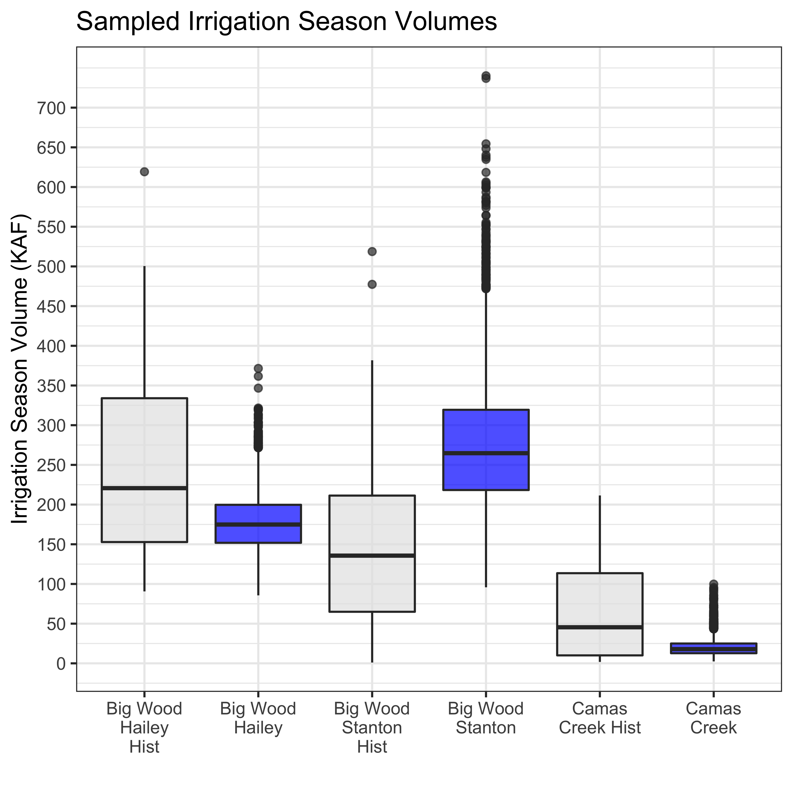
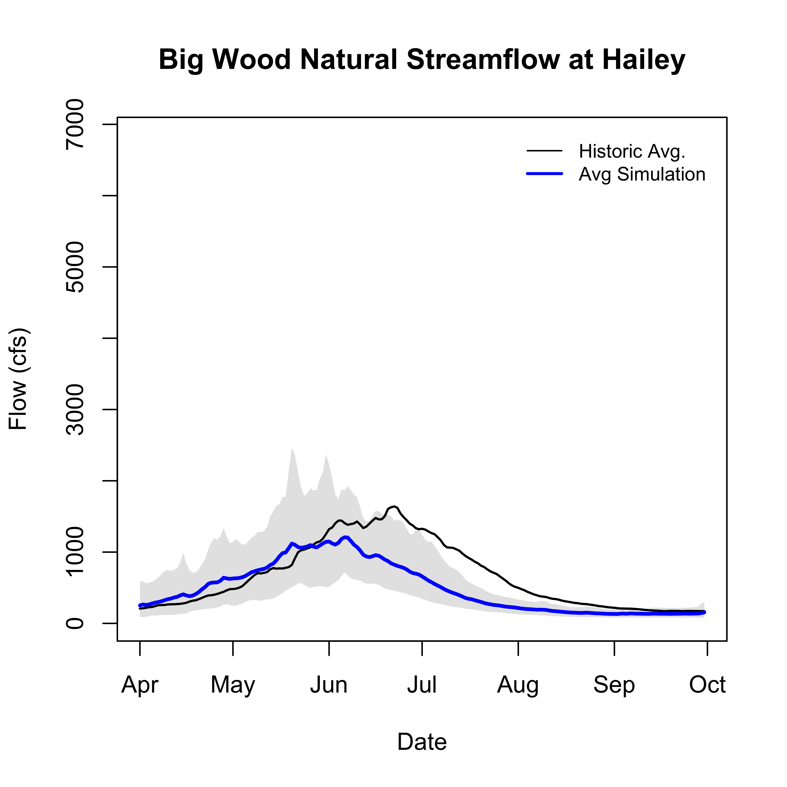
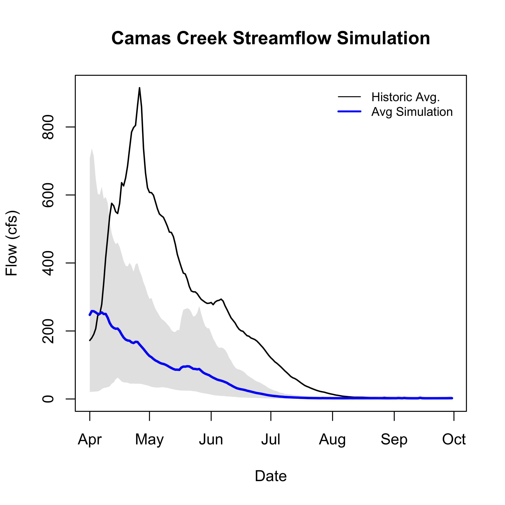

```{r include=FALSE}
library(knitr)
library(tidyverse)
library(ggplot2)
library(dplyr)
library(lubridate)
library(fasstr)

knitr::opts_chunk$set(echo = FALSE)

cd <- '~/Desktop/Data/WRWC'
data_dir <- file.path(cd, 'data')
fig_dir <<- '~/github/WRWC/figures'
fig_dir_mo <- file.path(fig_dir, 'March')

usgs_sites = read.csv(file.path(data_dir,'usgs_sites.csv'))
snotel_sites = read.csv(file.path(data_dir,'snotel_sites.csv'))
q = read.csv(file.path(data_dir,'streamflow_data.csv'))
q$Date <- as.Date(q$Date)
q$doy <- yday(q$Date)
q<- q %>% filter(abv != 'bwr')

#knitr::opts_knit$set(root.dir = '~/Desktop/Data/WRWC')

```

## Wood River Model Summary

The WRWC Modeling Suite predicts spring air temperatures, total summer runoff volumes, "center of mass", and timing of delivery calls in the Big Wood River Basin, Camas Creek and Silver Creek (Table 1, Figure 1). 


### Data Inputs
```{r data}
#Center of mass is ...

kable(usgs_sites[c(1,2,3,5),] %>% select(station_nm, huc_cd, begin_date, end_date, abv), caption = "USGS Sites")

kable(snotel_sites %>% select(start, end, site_name, huc8, abv), caption = "Snotel Sites")
```

## Data Summary
e.g. timeseries of streamflow from all gages
```{r All Data, echo=FALSE}
#ggplot(data = q, mapping = aes(x=as.Date(Date), y=Flow))+
 # geom_line(aes(color= abv))+
#  xlab('Date')+
 # ylab('Flow (cfs)')
```


```{r Big Wood, echo=FALSE}
### Big Wood at Hailey
#can add year-to-date data with exceedence probabilities

#Calculate day of water-year
water_year_begin <- ymd('1987-10-01')-1
#deal with leap years
q$doWY<- ((q$doy - yday(water_year_begin)) %% ifelse(leap_year(year(q$Date)), 366, 365)) +1

#Summary stats.
data <- group_by(q, doWY) %>% filter(abv == 'bwb') %>% mutate(meanQ=mean(Flow), maxQ=max(Flow), minQ=min(Flow))
#Plot
#ggplot(data=data, mapping=aes(x=doWY))+
 # geom_line(mapping=aes(y=meanQ), color='red')+
#  geom_ribbon(mapping=aes(ymin=minQ, ymax=maxQ), alpha=.1)
```

Data summary from Snotel Sites in the Big Wood

## Model Output, by sub-basin

### streamflow volume model output
```{r, sampled volumes, echo=FALSE, fig.cap="Simulated volumes", fig.aling="left", out.width = '100%', fig.pos='H'}

```

### streamflow simulations
```{r, bwh sim, echo=FALSE, fig.cap="Simulated volumes", fig.aling="left", out.width = '100%', fig.pos='H'}

```

```{r, bws sim, echo=FALSE, fig.cap="Simulated volumes", fig.aling="left", out.width = '100%', fig.pos='H'}
knitr::include_graphics("BWS_Simulation.png")
```

```{r, sc sim, echo=FALSE, fig.cap="Simulated volumes", fig.aling="left", out.width = '100%', fig.pos='H'}

```

```{r, cc sim, echo=FALSE, fig.cap="Simulated volumes", fig.aling="left", out.width = '100%', fig.pos='H'}

```


### curtailment date model output 
